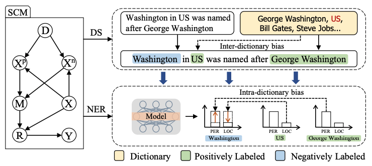

# DSCAU
This repo is our code and dataset for paper [De-biasing Distantly Supervised Named Entity Recognition
via Causal Intervention](https://arxiv.org/pdf/2106.09233.pdf). 
Our work is based on [BOND](https://github.com/cliang1453/BOND) and [PU-Learning](https://github.com/v-mipeng/LexiconNER). Therefore, our code is created by modifying their codes.

## Framework



## Data

We use the data from [BOND](https://github.com/cliang1453/BOND). We sampled several sub-dictionaries by sampling entities from the global dictionary. The probability of
each entity being sampled corresponds to its utterance frequency. Therefore, in each dataset (`DSCAU/dataset`), there are several `train*.json` files, each of them is generated by a single sub-dictionary.

## Environment
Python 3.7, `DSCAU/requirements_bond.txt` is the environment of BOND and `DSCAU/requirements_pul.txt` is the environment of PU-Learning.

## Training
For BOND:

```
cd DSCAU/BOND/
./scripts/train_conll2003.sh
./scripts/train_twitter.sh
./scripts/train_webpage.sh
./scripts/train_wikigold.sh
```

For PU-Learning:

<small>Download [glove.6B.100d.txt](https://nlp.stanford.edu/data/glove.6B.zip) first, and move it to the directory `DSCAU/PUL/data_bond/`</small>
```
cd DSCAU/PUL/
./scripts/train_conll2003.sh 
```

## Evaluation

For BOND:
```
cd DSCAU/BOND/
./scripts/eval_conll2003.sh
./scripts/eval_twitter.sh
./scripts/eval_webpage.sh
./scripts/eval_wikigold.sh
```

For PU-Learning:
```
cd DSCAU/PUL/
./scripts/eval_conll2003.sh
```

## Trained Models
You can download the following trained models and replace the `SAVED_DIR` in `eval_*.sh` with it to obtain the results.

|             | CoNLL03 | Twitter | Webpage | Wikigold |
|:-----------:|:---------:|:-------:|:-------:|:--------:|
|    BOND     |  [Download](https://drive.google.com/file/d/1ffX3gGGucSGtm8bRBXED2SV4FfYpAt1w/view?usp=sharing)        |  [Download](https://drive.google.com/file/d/1bG2nc8cKrKXSieLnXNKH7yJd7mIo3iCY/view?usp=sharing)       |   [Download](https://drive.google.com/file/d/1hO3cir4h2MdYKhbKWnuol0ywSEVLvYjl/view?usp=sharing)      |    [Download](https://drive.google.com/file/d/1R08d3nf1oRurE8ltVK1fhffYzYV10Ofi/view?usp=sharing)      |
| PU-Learning |  [Download](https://drive.google.com/file/d/1PMepS1YuPucA3DD270VM8AS5_eHfk5Sj/view?usp=sharing)         |    -     |    -     |    -      |


## Citation
Please cite our ACL 2021 paper:
```
@inproceedings{zhang-etal-2021-de,
    title = "De-biasing Distantly Supervised Named Entity Recognition via Causal Intervention",
    author = "Zhang, Wenkai  and
      Lin, Hongyu  and
      Han, Xianpei  and
      Sun, Le",
    booktitle = "Proceedings of the 59th Annual Meeting of the Association for Computational Linguistics and the 11th International Joint Conference on Natural Language Processing (Volume 1: Long Papers)",
    year = "2021",
    publisher = "Association for Computational Linguistics",
    pages = "4803--4813"
}
```
